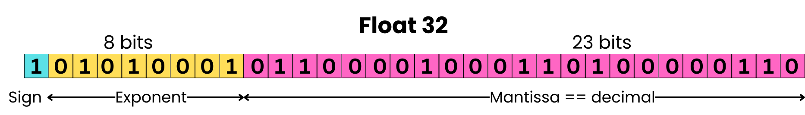
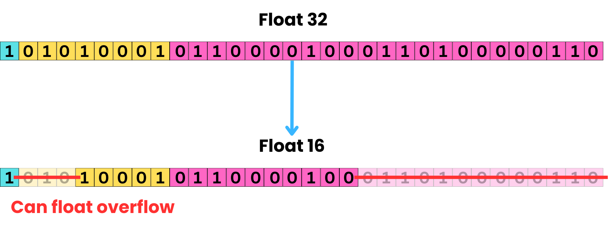



## How large is a large language model?

When comparing large language models, people talk in terms of billions of parameters. For example the prototypical LLM [GPT-3](https://arxiv.org/pdf/2005.14165) is a 175 billion parameter model. What this means is that GPT3 is a transformer based neural network with 175 billion parameters (also called weights) in its network. Each weight is a floating point number, so to store the model in memory means to store lots and lots of floats.

### Floating point numbers

Okay, so how big is a float? To answer this requires a quick aside on floating point numbers. Consider the real number \\(\pi=3.14159265...\\) As \\(\pi\\) has infinite digits we can only store a finite number of them in memory, so for a [float32](https://en.wikipedia.org/wiki/Single-precision_floating-point_format) we would store \\(\pi=3.1415927\\). More precisely, we would store this number in memory using 32-bits  as `0 10000000 10010010000111111011011` (spaces added for readability). Each section is respectively the sign, exponent and mantissa. To represent an arbitrary decimal, it is first decomposed into the product `(-1)^Sign x 2^(Exponent-127) x (1.Mantissa)` then stored as three integers `Sign Exponent Mantissa` For example `3.1415927 = -1^0 x 2^(128-127) x (1.5707964)` so we store it as `0 128 4788187`[^decimal-mantissa-conversion] which in binary is `0 10000000 10010010000111111011011`.

[^decimal-mantissa-conversion]: You might be a bit confused how `1.5707964` became `4788187`. For a decimal value `d` of the form `1.xxxx` and a mantissa of `N` bits we store the integer `M` in memory where: $$M = (d - 1) * 2^N$$ rounding as necessary to the nearest integer. You can then verify that $$4788187 = (1.5707963705062866 - 1) * 2^{23}$$ See [Floating Point Numbers](https://www.doc.ic.ac.uk/~eedwards/compsys/float/) for more details.

The float formats most often used for language modelling are [float32](https://en.wikipedia.org/wiki/Single-precision_floating-point_format), [float16](https://en.wikipedia.org/wiki/Half-precision_floating-point_format) or [bfloat16](https://en.wikipedia.org/wiki/Bfloat16_floating-point_format) (often abbreviated to fp32, fp16, bf16). The total number of bits used and how these bits are assigned to the exponent and mantissa is what differentiates them. They each make tradeoffs between dynamic range and precision. Precision is how many significant digits we store in memory and is determined by the mantissa. Dynamic range is how small or large of a number we can represent and depends solely on the exponent. Consider the following float32:

*Figure from [Float32 vs Float16 vs BFloat16](https://newsletter.theaiedge.io/p/float32-vs-float16-vs-bfloat16)*

The sign, exponent and mantissa correspond to `1`, `81` and `3181830` respectively in base 10. Converting to a decimal gives:[^mantissa-decimal-conversion]

[^mantissa-decimal-conversion]: Rearranging the formula from the above footnote gives $$d = 1 + M * 2^{-N}$$

$$ -1^1 * 2^{81-127} * (1 + 3181830*2^{-23}) = -1.9601084 \cdot 10^{-14}$$

It's worth pointing out that multiple decimals will map to the same float which is why it makes sense to only report floats to a limited number of significant figures[^float-significant-figures].

[^float-significant-figures]: For a mantissa of `N` bits, increasing least significant bit by one will increase our float by \\(2^{-N}\\). For a float32 this is \\(2^{-23} \approx 1.19 \cdot 10^{-7}\\). This is why multiple decimals map to the same float, as the float representation can only distinguish between decimals with difference greater than \\(2^{-N}\\). This is also why it only makes sense to report floats to a limited number of significant figures given by \\(\lfloor \log_{10}{2^{N}} \rfloor = \lfloor N \cdot \log_{10}{2} \rfloor \approx \lfloor N / 3 \rfloor\\). So for a float32, we should only report \\(\lfloor N / 3 \rfloor = 7\\) significant figures.

Now to convert from a fp32 to a bf16 we simply truncate the mantissa:

*Float32 to BFloat16 conversion figure from [Float32 vs Float16 vs BFloat16](https://newsletter.theaiedge.io/p/float32-vs-float16-vs-bfloat16)*

For our bfloat16, the mantissa takes up `7` bits and stores the value `48`. Converting to decimal gives:

$$ -1^1 * 2^{81-127} * (1 + 48*2^{-7}) = -1.95 \cdot 10^{-14}$$

We have lost some precision as the smallest difference between bf16 floats is \\(2^{-7} \approx 1 \cdot 10^{-2}\\) compared to \\(2^{-23} \approx 1 \cdot 10^{-7}\\) for fp32, but we are still able to represent the same dynamic range of numbers. If we were instead to try and convert to a float16 we would need to truncate both the exponent and the mantissa:

*Float32 to Float16 conversion with underflow figure from [Float32 vs Float16 vs BFloat16](https://newsletter.theaiedge.io/p/float32-vs-float16-vs-bfloat16)*

This leads to an issue as we want to fit the exponent with value `81` using 5 bits of memory. This is not possible as 5 bits can only store integers until `63` so we get an underflow error as the dynamic range of a float16 is not large enough to accommodate numbers closer to zero than \\(2^{-5} \approx 1 \cdot 10^{-3}\\).

While this might seem like a tangent, **LLMs are just a big bag of floats**. To understand how much memory is needed during training, fine-tuning and inference requires first understanding floats.

## Estimating GPU memory requirements

To summarize so far: **LLMs are just a big bag of floats**.

Loading a 1B parameter LLM into memory means loading 1B floats. If our weights are represented in half-precision with bf16 or fp16, each would require 16-bits or 2 bytes of memory. Double that if they are represented in a full-precision format like fp32. Therefore the VRAM (GPU memory) required to load a `X` billion parameter model into memory is `(bytes per parameter) * X * 10^9` bytes or `(bytes per parameter) * X` gigabytes (GB). As most LLMs are stored in half-precision, loading a LLM into memory requires approximately 2GB of VRAM per billion parameters.

However we don't just load an model into memory and then do nothing. Either we are generating text by performing inference, or we are updating the model weights by training. Each mode has vastly different memory requirements as we will see below.

### Inference

Inference is when the model generates text given some input (called a prompt). LLMs can only generate a fixed amount of text. The limit, known as the context window, is set during training and is a limit on the combined number of input and output tokens. For example, [GPT-3](https://arxiv.org/pdf/2005.14165) has a context window of 2048, so the prompt and the output combined can never exceed 2048 tokens. In its simplest form, inference is when the LLM generates the next token by performing a forward pass over all previously generated tokens. Imagine I provide the model with the prompt `<bos> Hi`, you could imagine the following output at each step:



|Step|Input Tokens|Output Token|
|----|------------|-----------|
|1|`<bos> Hi`|`I`|
|2|`<bos> Hi I`|`am`|
|3|`<bos> Hi I am`|`Hari`|
|4|`<bos> Hi I am Hari`|`Seldon!`|
|5|`<bos> Hi I am Hari Seldon!`|`<eos>`|



At each step, the inputs only differ by the last token. Therefore we are computing the same activations (intermediate results of the forward pass) again and again. This inefficiency is particularly bad due to the attention layer, and leads to a quadratic time complexity with respect to sequence length (length of the input tokens) for inference.

#### KV-Caching

To speed things up, we use a cache to store attention keys and values (refer to [Attention Mechanism](https://huggingface.co/blog/not-lain/tensor-dims) for more details). Known as [KV-Caching](https://huggingface.co/blog/not-lain/kv-caching), this leads to a linear time complexity with respect to sequence length at the expense of growing memory linearly. As the size of the cache depends on the structure of the attention layers, estimating the cache size in GB is model dependent. To complicate things further, libraries like [vLLM](https://docs.vllm.ai/en/latest/configuration/optimization.html) allow you to specify GPU memory utilization, and then it scales the KV-cache size up or down based on its allocation of VRAM. If you want to serve more than one user at once, then you need to batch the inputs, so doubling the batch size also doubles the KV-cache. If you know ahead of time what model you plan to use, then this [KV Cache Memory Calculator](https://bentoml.com/llm/inference-optimization/kv-cache-offloading#how-to-calculate-the-kv-cache-size) will spit out the memory consumption of the cache.

#### Quantization

Post-training quantization reduces memory consumption by storing (some subset of) the weights, activations and KV-cache using fewer bits. This is done by mapping the original weights in fp32/bf16/fp16 to a smaller data type like int8/fp8/int4 without losing too much performance. The quantized data types, as their names suggest, are integers or floats stored in 8-bit or 4-bit representations. Without going into details on how this is done (refer to [Selecting a quantization method](https://huggingface.co/docs/transformers/v4.56.2/quantization/selecting) and [Quantization concepts](https://huggingface.co/docs/transformers/v4.56.2/quantization/concept_guide) for those interested), quantization can reduce memory usage by a factor of 2 to 4 with minimal drop in accuracy.

#### Summary

Therefore inference requires anywhere from 0.5 - 2 GB of VRAM per billion parameters to load the weights plus the memory for the KV-cache.

TODO: Go through the example with [Qwen2.5-7B](https://huggingface.co/Qwen/Qwen2.5-7B) to be able to give ballpark figures for super optimized quantized unsloth implementation vs more naive vLLM. 

TODO: Explain how inference is generating text starting from an input sequence (prompt). Next how this introduces a dependency on the sequence length. Next how flash attention and kv-cache optimize memory usage and speed. Next how can use quantization to further reduce memory requirement. Lastly, what does this mean in total for inference memory requirements.

### Training

TODO: Explain how training is much much more costly than inference. How we focus on SFT which is how train base language model, but RLHF is another important step, but one we ignore today. How need to store model states and activation memory, what each of them is and how much they contribute. Explain the major optimizations used during training: flash attention, mixed-precision training and activation checkpointing. Explain how tradeoffs they incur wrt training time, memory usage and performance. Explain how batch size plays a role, and trick with gradient accumulation to simulate larger batch size. Lastly, what does this mean in total for training memory requirements.

[FlashAttention](https://arxiv.org/pdf/2205.14135) more efficiently moves around data on the GPU leading to a linear and not quadratic memory compexity with respect to sequence length.

### Fine-tuning

TODO: Explain how fine-tuning can mean additional training or usually now PEFT. How does llora and qlora work and why require so much less memory. Lastly, what does this mean in total for fine-tuning memory requirements.

<!-- 
## Training vs Inference

So far we have discussed the memory usage of loading the model weights. However when we train our model, we have to store not just the model weights but also activations, gradients, optimizer states. Likewise for inference we also need to store the KV cache.

### Training

Training the model means updating the model weights based on the training data. We do a forward pass to get the output for a batch of training examples, compute the loss, then backpropagate to get the gradient of each weight. We then update the weight using a gradient descent algorithm that moves each weight in the direction that minimizes the loss.

#### Model states

If you look up a model on hugging face, you often see the label `Tensor type | BF16`. This indicates that the model weights are stored as bf16 floats, however during training it is common to keep an additional copy of the weights in fp32 to improve performance. This is known as [Mixed Precision Training](https://arxiv.org/pdf/1710.03740). The effect is that we require 6 bytes per parameter during training (2 bytes for bf16/fp16 and 4 bytes for fp32).

We always need to track gradients during training so that is another 2 bytes per parameter if they are stored in half-precision (4 for fp32). [AdamW](https://docs.pytorch.org/docs/stable/generated/torch.optim.AdamW.html) is probably the most popular optimization algorithm for transformers. Adam requires tracking the momentum and variance of the gradients to perform an update step:

So we need an additional 8 bytes per parameter for momentum and variance stored as fp32.

In total we have the following bytes per parameter (this is a worst case estimate): `(2 + 4) for the parameters themselves in 16 and 32 bits` + `8 for AdamW states` + `2 for gradients` = `16 bytes`. As model states dominate the memory usage, a common rule of thumb is this factor of 16 when estimating memory requirements e.g. a 7B parameter model would require 7*16 = 112 GB of memory to train.

#### Activation memory

Another large memory requirement during training is the activation memory i.e. the intermediate results computed during the forward pass and stored for backpropagation per [The Memory Anatomy of Large Language Models: A Surgeon's Guide](https://themlsurgeon.substack.com/p/the-memory-anatomy-of-large-language). This means for each batch of training data we have approximately that:

$$\text{activation memory}$$

$$\approx$$

$$\text{transformer layers} \times \text{hidden dimensions} \times \text{sequence length} \times \text{batch size}$$

However this is often combined with [Activation checkpointing (or gradient checkpointing)](https://arxiv.org/pdf/1604.06174) which reduces the memory requirement to the square root of the activation memory. It does this by recomputing activations during the backward pass rather than storing them in memory. [FlashAttention](https://huggingface.co/papers/2205.14135) is another optimization that avoids memory scaling quadratically with sequence length when computing activations.

See [Efficient Deep Learning: A Comprehensive Overview of Optimization Techniques](https://huggingface.co/blog/Isayoften/optimization-rush), [Optimizing LLMs for Speed and Memory](https://huggingface.co/docs/transformers/v4.56.2/llm_tutorial_optimization) and [Efficient Training on a Single GPU](https://huggingface.co/docs/transformers/v4.20.1/en/perf_train_gpu_one) for a more detailed overview of all the training optimizations.

It is more difficult to give an exact memory usage for the activation memory, so I would say in general **a good ballpark for training memory usage is 16 bytes per model parameter**.

### Fine-tuning

If we are trying to adapt an LLM to a downstream task, we might want to perform additional training on a dataset of examples of our specific task. This is fine-tuning. However it is quite computationally expensive to update all the model parameters and in general PEFT (Parameter-Efficient Fine-Tuning) is done instead where we only update a small subset of parameters.

The most popular and effective method at the moment is [LoRa](https://arxiv.org/pdf/2106.09685) and [QLoRa](https://arxiv.org/pdf/2305.14314).

**Diagram from [Hugging Face LoRA Overview](https://huggingface.co/docs/peft/main/en/conceptual_guides/lora)**

LoRA stand for Low-Rank Adaptation. The idea is to freeze the original weight matrix \\(W\\) and only update two smaller low-rank matrices \\(A\\) and \\(B\\). Depending on the implementation, there are a few hyper-parameters to choose, the two most influential being the rank \\(r\\) of these matrices and the target modules (i.e. target weight matrices to apply the LoRa updates such as attention or MLP layers). The higher rank we pick and the more layers we target directly results in a larger memory requirement, however this additional memory is on the order of `1/%` of the model training parameters. QLoRa allows additional memory savings by a factor of 4 by quantizing the model weights to 4-bits and using 4-bit adapters. [Unsloth LoRA Hyperparameters Guide](https://docs.unsloth.ai/get-started/fine-tuning-llms-guide/lora-hyperparameters-guide) provides additional details.

For example this [Llama-3-8b fine-tuning tutorial with unsloth](https://docs.unsloth.ai/get-started/fine-tuning-llms-guide/tutorial-how-to-finetune-llama-3-and-use-in-ollama) has `41,943,040` additional parameters (~0.42B), that is `0.524/%` additional memory, and in total requires 70\% less VRAM to fine-tune compared to a training.

### Effective Batch Size

The last factor that influences the memory requirements during training and fine-tuning is the effective batch size: [`effective_batch_size = batchsize * gradient_accumulation_steps`](https://docs.unsloth.ai/get-started/fine-tuning-llms-guide/lora-hyperparameters-guide#effective-batch-size).

- `batch_size` is how many training examples we process in parallel per forward pass. The the activations, gradients and optimizer states increase linearly with the batch size as we must store all this information before our gradient update step.

- `gradient_accumulation_steps` is how many batches to process before updating the gradients. It allows us to simulate larger batch sizes, hence using less VRAM at the cost of increase training time.

These parameters are set by experimentation to get a effective batch size in the 4 to 16 range without running out of memory.

### Sequence Length

TODO: add this section

### Inference

[KV Caching Explained: Optimizing Transformer Inference Efficiency](https://huggingface.co/blog/not-lain/kv-caching) -->


