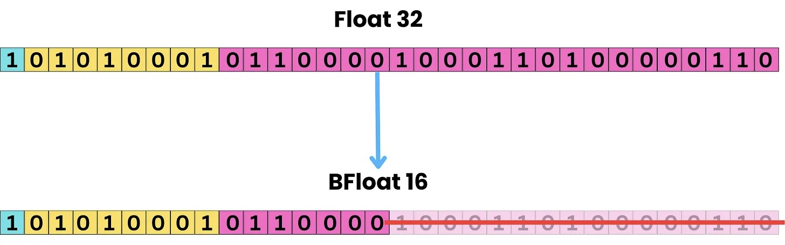
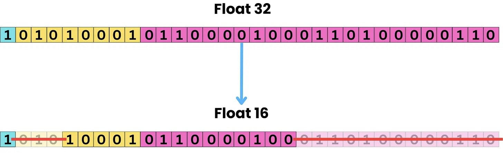
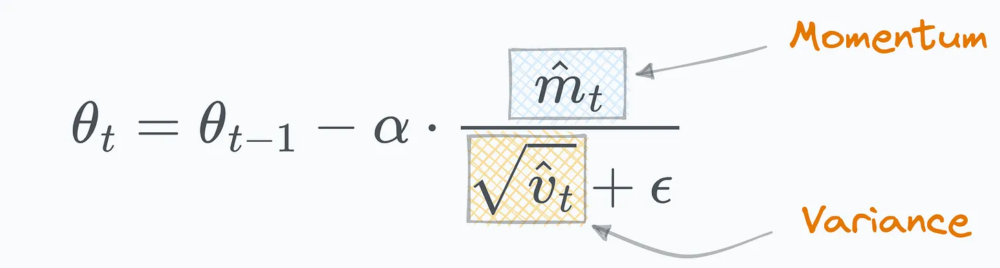



## What does a 1B parameter model mean?

Usually when discussing LLMs people say it is a X billion parameter model. For example the prototypical LLM [GPT-3](https://arxiv.org/pdf/2005.14165) was a 175 billion parameter model. An LLM is (a transformer based) neural network, and so parameters are the weights of this network. Each weight is a floating point numbers stored as a [float32](https://en.wikipedia.org/wiki/Single-precision_floating-point_format), [float16](https://en.wikipedia.org/wiki/Half-precision_floating-point_format) or [bfloat16](https://en.wikipedia.org/wiki/Bfloat16_floating-point_format) (often abbreviated to fp32, fp16, bf16). So a 1B parameter LLM is a neural network of 1B floating point weights.

### Floating point numbers

A quick aside on floating point numbers is necessary. Consider the real number \\(\pi=3.14159265...\\). As \\(\pi\\) has infinite digits we can only store a finite number of them in memory, this is the precision of the floating point number. For a [float32](https://en.wikipedia.org/wiki/Single-precision_floating-point_format) we would store \\(\pi=3.14159274101257324\\) where `3.14159274101257324 = -1^0 x 2^1 x (1 + 0.5707963705062866)` would be represented in memory as 32 bits in the form `0 10000000 10010010000111111011011` (spaces added for readability, but it would just be a single 32-bit integer). In general a decimal `(-1)^Sign x 2^(Exponent-127) x (1 + 0.Mantissa)` would be stored as a float32 in memory as the integer `Sign Exponent Mantissa` (see [Floating Point Numbers](https://www.doc.ic.ac.uk/~eedwards/compsys/float/) for more details).

The number of bits assigned to the exponent and mantissa is what differentiates fp32, fp16 and bf16. They each make tradeoffs between dynamic range and precision. Precision as we have already mentioned is how many significant digits we store in memory e.g. float32 has more precision than bfloat16 as the 23 bit mantissa of the float32 allows for more significant digits than the 10 bit mantissa of the bfloat16:

*[The same decimal represented as a float32 and as a bfloat16](https://newsletter.theaiedge.io/p/float32-vs-float16-vs-bfloat16)*

Dynamic range on the other hand is how small or large of a number we can represent, this depends solely on the exponent. As the above figure shows, a bfloat16 has the same dynamic range as a float32 but takes up only 16 bits in memory vs 32 bits at the expense of lower precision. On the other hand, a float16 can represent a smaller dynamic range than a bfloat16 but it has a higher precision:

*[The same decimal represented as a float32 and as a float16](https://newsletter.theaiedge.io/p/float32-vs-float16-vs-bfloat16)*

As the names suggest a float32 uses 32-bits in memory, compared to 16 for a float16 or bfloat16. Each data type makes different tradeoff between memory usage, dynamic range and precision. bf16 is very commonly used for LLMs as it prevents overflow errors converting from 32-bit to 16-bit representations as the dynamic range is the same, and it only costs a little bit of precision relative to a fp16.

### Estimating GPU memory requirements

Therefore, it follows that VRAM (GPU memory) requirement to load a `X` billion parameter model is `(bytes per parameter) * X * 10^9` bytes or `(bytes per parameter) * X` GB. So the ballpark memory requirements per billion parameters are:



| Precision           | VRAM (GB per billion params) |
|---------------------|------------------------------|
| float32             | 4            |
| bfloat16 / float16  | 2            |



### Quantization

Quantization can lower the memory requirement of the weights by storing them using even less bits, usually as int8 or int4. These data types are what their name suggests, integers stored in 8-bit or 4-bit representations. The main idea is to map the original weights in fp32/bf16/fp16 to a much smaller range, without losing to much performance. The two approaches are:

1. Calibration-based quantization
2. On-the-fly quantization.

With the first approach we need a calibration dataset to help us set the quantized weights, while the second approach directly shrinks the weights but is often less accurate than using a calibration dataset. See [Selecting a quantization method](https://huggingface.co/docs/transformers/v4.56.2/quantization/selecting) and [Quantization concepts](https://huggingface.co/docs/transformers/v4.56.2/quantization/concept_guide) for more details. In short, quantization can give a 2 to 4 times decrease in the memory requirement with minimal drop in accuracy.

## Training vs Inference

So far we have discussed the memory usage of loading the model weights. However when we train our model, we have to store not just the model weights but also activations, gradients, optimizer states. Likewise for inference we also need to store the KV cache.

### Training

Training the model means updating the model weights based on the training data. We do a forward pass to get the output for a batch of training examples, compute the loss, then backpropagate to get the gradient of each weight. We then update the weight using a gradient descent algorithm that moves each weight in the direction that minimizes the loss.

#### Model states

If you look up a model on hugging face, you often see the label `Tensor type | BF16`. This indicates that the model weights are stored as bf16 floats, however during training it is common to keep an additional copy of the weights in fp32 to improve performance. This is known as [Mixed Precision Training](https://arxiv.org/pdf/1710.03740). The effect is that we require 6 bytes per parameter during training (2 bytes for bf16/fp16 and 4 bytes for fp32).

<!-- *Mixed precision training iteration for a layer.* -->

We always need to track gradients during training so that is another 2 bytes per parameter if they are stored in half-precision (4 for fp32). [AdamW](https://docs.pytorch.org/docs/stable/generated/torch.optim.AdamW.html) is probably the most popular optimization algorithm for transformers. Adam requires tracking the momentum and variance of the gradients to perform an update step:

So we need an additional 8 bytes per parameter for momentum and variance stored as fp32.

In total we have the following bytes per parameter (this is a worst case estimate): `(2 + 4) for the parameters themselves in 16 and 32 bits` + `8 for AdamW states` + `2 for gradients` = `16 bytes`. As model states dominate the memory usage, a common rule of thumb is this factor of 16 when estimating memory requirements e.g. a 7B parameter model would require 7*16 = 112 GB of memory to train.

#### Activation memory

Another large memory requirement during training is the activation memory i.e. the intermediate results computed during the forward pass and stored for backpropagation per [The Memory Anatomy of Large Language Models: A Surgeon's Guide](https://themlsurgeon.substack.com/p/the-memory-anatomy-of-large-language). This means for each batch of training data we have approximately that:

$$\text{activation memory}$$

$$\approx$$

$$\text{transformer layers} \times \text{hidden dimensions} \times \text{sequence length} \times \text{batch size}$$

However this is often combined with [Activation checkpointing (or gradient checkpointing)](https://arxiv.org/pdf/1604.06174) which reduces the memory requirement to the square root of the activation memory. It does this by recomputing activations during the backward pass rather than storing them in memory. [FlashAttention](https://huggingface.co/papers/2205.14135) is another optimization that avoids memory scaling quadratically with sequence length when computing activations.

See [Efficient Deep Learning: A Comprehensive Overview of Optimization Techniques](https://huggingface.co/blog/Isayoften/optimization-rush), [Optimizing LLMs for Speed and Memory](https://huggingface.co/docs/transformers/v4.56.2/llm_tutorial_optimizatio) and [Efficient Training on a Single GPU](https://huggingface.co/docs/transformers/v4.20.1/en/perf_train_gpu_one) for a more detailed overview of all the training optimizations.

It is more difficult to give an exact memory usage for the activation memory, so I would say in general **a good ballpark for training memory usage is 16 bytes per model parameter**.

### Fine-tuning

If we are trying to adapt an LLM to a downstream task, we might want to perform additional training on a dataset of examples of our specific task. This is fine-tuning. However it is quite computationally expensive to update all the model parameters and in general PEFT (Parameter-Efficient Fine-Tuning) is done instead where we only update a small subset of parameters.

The most popular and effective method at the moment is [LoRa](https://arxiv.org/pdf/2106.09685) and [QLoRa](https://arxiv.org/pdf/2305.14314).

**Diagram from [Hugging Face LoRA Overview](https://huggingface.co/docs/peft/main/en/conceptual_guides/lora)**

LoRA stand for Low-Rank Adaptation. The idea is to freeze the original weight matrix \\(W\\) and only update two smaller low-rank matrices \\(A\\) and \\(B\\). Depending on the implementation, there are a few hyper-parameters to choose, the two most influential being the rank \\(r\\) of these matrices and the target modules (i.e. target weight matrices to apply the LoRa updates such as attention or MLP layers). The higher rank we pick and the more layers we target directly results in a larger memory requirement, however this additional memory is on the order of `1/%` of the model training parameters. QLoRa allows additional memory savings by a factor of 4 by quantizing the model weights to 4-bits and using 4-bit adapters. [Unsloth LoRA Hyperparameters Guide](https://docs.unsloth.ai/get-started/fine-tuning-llms-guide/lora-hyperparameters-guide) provides additional details.

For example this [Llama-3-8b fine-tuning tutorial with unsloth](https://docs.unsloth.ai/get-started/fine-tuning-llms-guide/tutorial-how-to-finetune-llama-3-and-use-in-ollama) has `41,943,040` additional parameters (~0.42B), that is `0.524/%` additional memory, and in total requires 70\% less VRAM to fine-tune compared to a training.

### Effective Batch Size

The last factor that influences the memory requirements during training and fine-tuning is the effective batch size: [`effective_batch_size = batchsize * gradient_accumulation_steps`](https://docs.unsloth.ai/get-started/fine-tuning-llms-guide/lora-hyperparameters-guide#effective-batch-size).

- `batch_size` is how many training examples we process in parallel per forward pass. The the activations, gradients and optimizer states increase linearly with the batch size as we must store all this information before our gradient update step.

- `gradient_accumulation_steps` is how many batches to process before updating the gradients. It allows us to simulate larger batch sizes, hence using less VRAM at the cost of increase training time.

These parameters are set by experimentation to get a effective batch size in the 4 to 16 range without running out of memory.

### Inference

[KV Caching Explained: Optimizing Transformer Inference Efficiency](https://huggingface.co/blog/not-lain/kv-caching)


