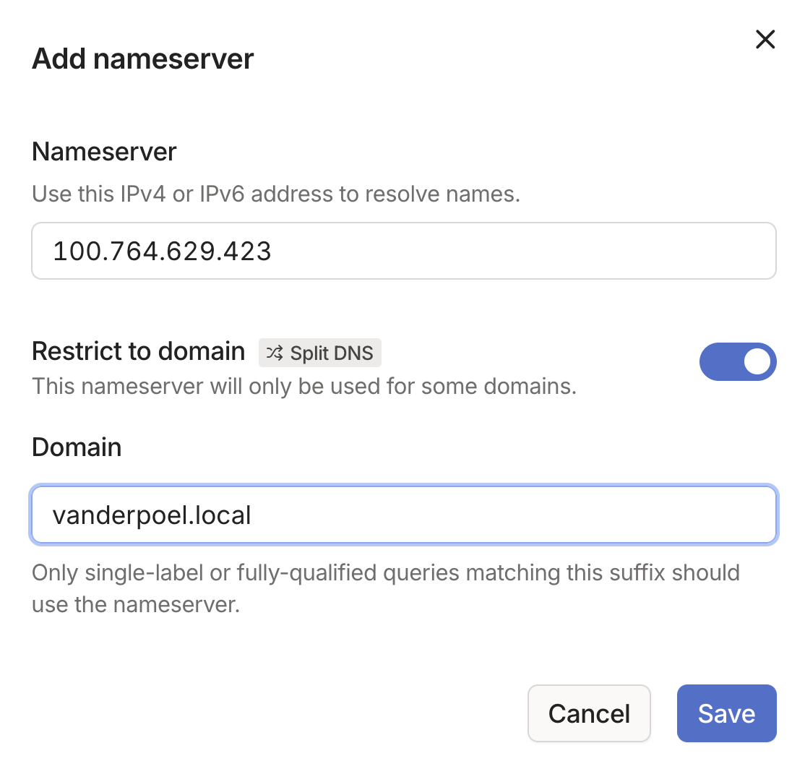

## Motivation

Let's say you have an ubuntu home server that runs some services like Immich, Home Assistant etc. Maybe you also have some internal websites you host. It would be nice if you could access these sites remotely and if they had nice domain names like `immich.vanderpoel.internal`, but we don't want expose anything to the public internet. Our goals are therefore:

1. Remotely access any service hosted on our server

2. Access these services via human-readable domain names e.g. `immich.vanderpoel.internal`

3. Do this without exposing these services to the wider internet

We can do this using [Tailscale](https://tailscale.com/), [Split DNS](https://tailscale.com/learn/why-split-dns) a local DNS server and a reverse proxy. I assume Tailscale is already installed on both the server and your local machine, otherwise follow the [Tailscale quickstart guide](https://tailscale.com/kb/1017/install). We also need to retrieve the `Tailnet DNS name` and `Machine name` for our server from the Tailscale admin console under the `DNS` and `Machines` tabs respectively. For the sake of this tutorial assume our server name is `slippery-server` and the Tailnet DNS name is `pompous-pufferfish.ts.net`.

## Setup a local service

We need to first run some service on our ubuntu home server. Let's take the example of running our own ChatGPT like interface based on [Self-host a local AI stack](https://tailscale.com/blog/self-host-a-local-ai-stack). Feel free to skip this section if you already know how to setup a service on your home server. The important point is that when we are done we will have a local LLM service running on `http://localhost:3000/` that is also accessible at `http://slippery-server.pompous-pufferfish.ts.net:3000/` from any device in our Tailnet.

### NVIDIA GPU setup

Follow the [Ubuntu Server documentation](https://documentation.ubuntu.com/server/how-to/graphics/install-nvidia-drivers/index.html) to install the necessary drivers. We also need to install CUDA per [the NVIDIA documentation](https://docs.nvidia.com/cuda/cuda-installation-guide-linux/contents.html) (we selected the proprietary kernel module flavor). An important post-installation step is:

```shell
sudo tee /etc/profile.d/cuda.sh > /dev/null <<'EOF'
export PATH=/usr/local/cuda-12.9/bin:$PATH
export LD_LIBRARY_PATH=/usr/local/cuda-12.9/lib64:$LD_LIBRARY_PATH
EOF

sudo chmod +x /etc/profile.d/cuda.sh
```

### Docker install

We will install our services using Docker, so follow the instructions at [Install Docker Engine on Ubuntu](https://docs.docker.com/engine/install/ubuntu/). Don't forget the [Linux post-installation steps for Docker Engine](https://docs.docker.com/engine/install/linux-postinstall/) so that non-root users can run docker. Then check everything is installed with `docker run hello-world` which should output:

```shell
>>> docker run hello-world

Hello from Docker!
This message shows that your installation appears to be working correctly.
[...]
```

We also need to install [NVIDIA Container Toolkit](https://docs.nvidia.com/datacenter/cloud-native/container-toolkit/latest/install-guide.html), then restart docker with `sudo systemctl restart docker`. You can check that the GPU is working inside docker with:

```shell
docker run --rm -it --gpus=all nvcr.io/nvidia/k8s/cuda-sample:nbody nbody -gpu -benchmark
```

### Running a Local ChatGPT Interface

For the purposes of this tutorial, you can use the [run-compose.sh](https://raw.githubusercontent.com/open-webui/open-webui/refs/heads/main/run-compose.sh) script from Open WebUI:

```shell
git clone git@github.com:open-webui/open-webui.git
cd open-webui/
chmod +x run-compose.sh
./run-compose.sh --enable-gpu
```

We now have Open WebUI running on `http://localhost:3000/` which can be accessed via our local machine with Tailscale running at `http://<server-name>.<tailnet-name>.ts.net:3000/` which in our case is `http://slippery-server.pompous-pufferfish.ts.net:3000/`.

## Human-readable domain names

We have now achieved our first goal which is to have remote access to any service hosted on `slippery-server`. In our case we have Open WebUI running at `http://slippery-server.pompous-pufferfish.ts.net:3000/`. The next goal is have this site accessible instead at `https://immich.vanderpoel.internal`.

### Local DNS Server

The [Domain Name System (DNS)](https://aws.amazon.com/route53/what-is-dns/) protocol is how we can type `liamvanderpoel.com` into our browser and be routed to the actual IP address where my website is hosted e.g. `37.16.9.210`. This occurs because after I bought my domain name I went to my DNS provider (e.g. Cloudflare, Namecheap, ...) and created DNS records that publicly store this mapping `liamvanderpoel.com` to `37.16.9.210` (i.e. the A, AAAA, CNAME records). We would like the same thing to occur inside our Tailnet where `*vanderpoel.internal` points to the `slippery-server` machine.

Note: In my first draft of this article I used `vanderpoel.local`, but this can lead to various issues so I changed it. If you want to go down a bit of a rabbit hole see [Why Using a .local Domain for Internal Networks is a Bad Idea](https://thexcursus.org/why-using-a-local-domain-for-internal-networks-is-a-bad-idea/).

Recall our goal is to access our local services hosted on the `slippery-server` machine. This machine likely doesn't have a publicly reachable ip address, so we can't just buy a new domain and point it to our servers ip address. We also probably don't want to have to buy a new domain name each time we add a new server as we only want these machines to be accessible inside our Tailnet. The solution is to run our own local DNS server to map a domain of our choosing to the private ip address of `slippery-server` inside the Tailnet. We can use any domain name we want, but in practice it make sense not to use a domain already in use as this can lead to confusion if say `google.com` gets remapped to point to a service on one of our local machines.

We therefore install [dnsmasq](https://wiki.archlinux.org/title/Dnsmasq) on `slippery-server` (can run on any server inside the Tailnet):

```shell
sudo apt install dnsmasq
```

Then configure dnsmasq by running `sudo vim /etc/dnsmasq.conf` and add the lines:

```text
# Only bind to Tailscale interface
interface=tailscale0
bind-dynamic

# Local domain
address=/vanderpoel.internal/100.764.629.423
```

The ip address `100.764.629.423` is that of `slippery-server.pompous-pufferfish.ts.net` and can be found under the `Machines` tab in the admin console. Then restart dnsmasq:

```shell
sudo systemctl restart dnsmasq
```

We then need to setup [Split DNS](https://tailscale.com/learn/why-split-dns) to route anything ending in `vanderpoel.internal` to the `slippery-server` machine. This requires adding a custom nameserver under the `DNS` tab in the admin console where the `Nameserver` the ip address of `slippery-server` i.e. `100.764.629.423` and the domain is `vanderpoel.internal`:



We can now test our dns by running `dig anything.vanderpoel.internal` on any device in our Tailnet and we should see the request get routed to the `100.764.629.423` ip address:

```shell
> dig anything.vanderpoel.internal
[...]

;; ANSWER SECTION:
anything.vanderpoel.internal. 0   IN      A       100.764.629.423
[...]
```

### Reverse Proxy

TODO: immich.vanderpoel.internal pointing to the immich service is due to reverse proxy like caddy, not due to DNS setup

<!-- ### HTTP to HTTPS

Right now nothing is encrypted and we have to remember what port we are serving. To fix both these issues, navigate to the `DNS` tab in the admin console and turn on both `MagicDNS` and `HTTPS Certificates`. This allows us to use [Tailscale Serve](https://tailscale.com/kb/1312/serve):

```shell
tailscale serve --bg 3000
```

and now our service will be made available at `https://slippery-server.pompous-pufferfish.ts.net`.

Note: This does put `http://slippery-server.pompous-pufferfish.ts.net` in the public ledger, so it is important to state **Do not enable the HTTPS feature if any of your machine names contain sensitive information.** See [Enabling HTTPS](https://tailscale.com/kb/1153/enabling-https) for more details.
-->




