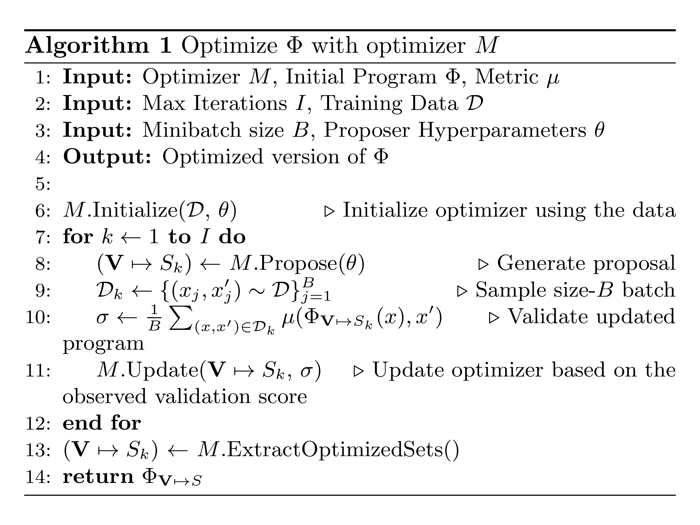
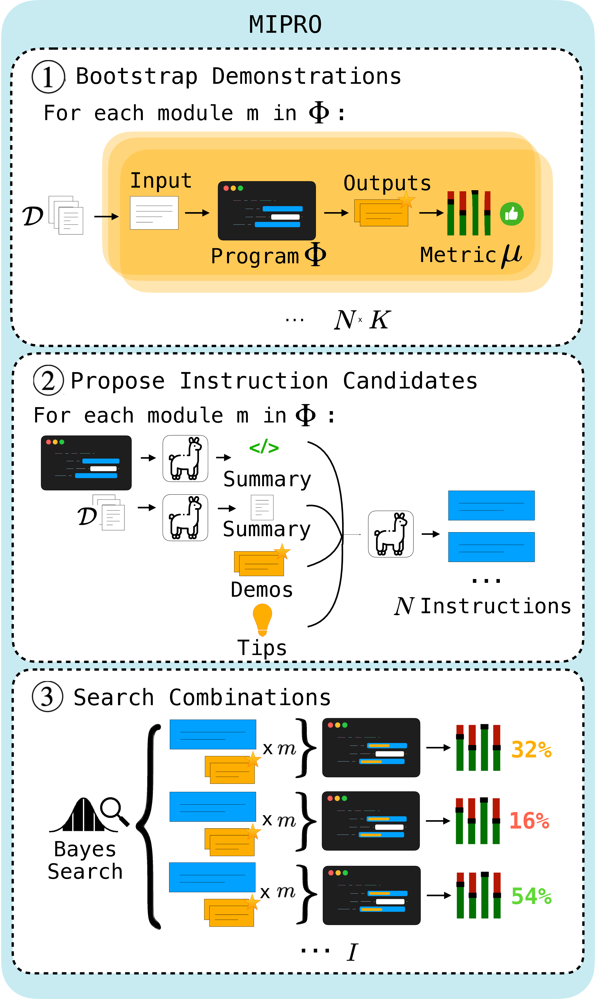
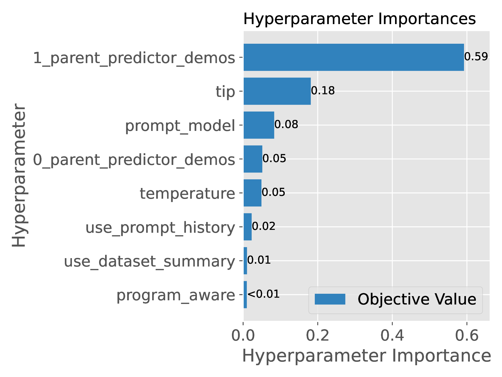



I want to understand how prompt optimization works in the context of the [DSPy framework](https://dspy.ai/), starting from the paper [Optimizing Instructions and Demonstrations for Multi-Stage Language Model Program](https://arxiv.org/pdf/2406.11695).
  
## Language model program optimization

A language model (LM) program is a large language model (LLM) and associated code that leverages the LM to solve a specific task. For example you might want to perform sentiment classification with on [IMBD reviews](https://huggingface.co/datasets/stanfordnlp/imdb). So you pick a suitible LLM, maybe Llama 3.1, and prompt it with `Classify the sentiment of a the following movie review as positive or negative.`, followed by a review. You might then need to do some post-processing to ensure that the model does not ramble and only outputs a sentiment. You are now faced with two potential problems:

1. How do you write modular programs that are easy to modify and are not dependent on the specifics of our LLM choice?

2. How do we pick our prompts to achieve the best performance possible for a given LLM and task?

With DSPy you deal with the first problem by defining modules which specify inputs/outputs effectively decoupling the code that solves the task (program in DSPy speak) from your language model. For example:

```python
from typing import Literal

class Classify(dspy.Signature):
    """Classify sentiment of a movie review."""

    sentence: str = dspy.InputField()
    sentiment: Literal['positive', 'negative'] = dspy.OutputField()

classify = dspy.Predict(Classify)
classify(sentence="The Lord of the Rings: The Fellowship of the Ring was the best movie ever")
```

The second problem is more challenging. One approach is given by the following algorithm.



The two key elements are the optimizer and the metric. The optimizer decides how to tune the prompt, and the metric tells us the quality of a response. To explain this algorithm in concrete terms, let's consider the task [HotpotQA](https://hotpotqa.github.io/) where we want to answer a question using two relevant passages retrieved from Wikipedia articles. An example from the dev set is given below:

|                        |                                                                                                                                                                                                                       |
| ---------------------- | --------------------------------------------------------------------------------------------------------------------------------------------------------------------------------------------------------------------- |
| **Golden Paragraph A** | **Dave Pirner Article** <br>David Anthony "Dave" Pirner (born April 16, 1964) is an American songwriter, singer, and producer best known as the lead vocalist and frontman for the alternative rock band Soul Asylum. |
| **Golden Paragraph B** | **Les McKeown Article** <br>Leslie Richard McKeown (born 12 November 1955) is a Scottish pop singer who was the lead singer of the Bay City Rollers during their most successful period.                              |
| **Question**           | What type of profession do Dave Pirner and Les McKeown both have?                                                                                                                                                     |
| **Answer**             | Singer                                                                                                                                                                                                                |

A program \\(\Phi\\) to solve the task needs to retrieve relevant articles from Wikipedia, then it needs to answer the question given the information in those articels. The [paper](https://arxiv.org/pdf/2406.11695) proposes decoposing the program into two modules \\(m_1\\) and \\(m_2\\) (`generate_query` and `generate_answer` respectively) which are parameterized by their internal prompt templates \\(p_1, p_2\\). The full program looks like:

```python
class MultiHop(dspy.Module):
    def __init__(self):
        self.retrieve = dspy.Retrieve(k=3)
        self.generate_query = dspy.ChainOfThought("context, question -> search_query")
        self.generate_answer = dspy.ChainOfThought("context, question -> answer")
    
    def forward(self, question):
        context = []
        for hop in range(2):
            query = self.generate_query(context, question).search_query
            context += self.retrieve(query).passages
        return self.generate_answer(context, question).answer
```

### Initialize the optimizer using the data

Following the algorithm above, we would next initialize the optimizer. I will skip explaining this step until after we discuss how optimizers work as the details are quite optimizer specific. At the minimum it passes hyperparameter information to the optimizer. This is also where we would generate bootstrapped examples.

### Generate a proposal using the optimizer

Each prompt template \\(p_i\\) has a set of variables (open slots) that we fill in before passing the final prompt to the LLM. The collection \\(\mathcal{V} \to S_k\\) means the prompt templates we use at the \\(k^{th}\\) iteration of our optimization loop. For example we might use this template for the `generate_answer` module:

```python
f"""
Given the following context answer the question.

Context:
{paragraph_a}

{paragraph_b}

Question:
{question}

Answer:
"""
```

This generation procedure is specific to the optimizer \\(M\\) and the hyperparameters \\(\theta\\), but with the above example you could imagine it might tweak the first sentence `Given the following context answer the question.` or add examaples of what sucessfully answering a question looks like.

### Sample a batch

Pretty straightforward, randomly pick \\(B\\) examples from our dataset on which to compute a validation score. This is \\(\mathcal{D}_k\\) at the \\(k^{th}\\) step.

### Validate updated program

The score for a particular example \\((x, x')\\) is \\(\mu(\Phi_{\mathcal{V} \to S_k}(x), x')\\), where \\((x, x')\\) is question/answer pair (not including the golden retrieved paragraphs). A suitible choice of metric \\(\mu\\) is exact match, i.e. are the answers exactly equal. The notation \\(\Phi_{\mathcal{V} \to S_k}\\) means our program with the  \\(k^{th}\\) version of all our prompt templates. So in words

$$\sigma \leftarrow \frac{1}{B} \sum\limits_{(x, x') \in \mathcal{D}_k} \mu\left(\Phi^{(k)}(x), x'\right)$$

is how well the \\(k^{th}\\) version of our program performs with respect to the examples in batch \\(B\\). Here \\(\Phi^{(k)}\\) is shorthand for \\(\Phi_{\mathcal{V} \to S_k}\\).

Interesting to note is that the validation score is computed on the program level and not on the module level as the metric only looks at the program output \\(x'\\). This is why although we have access to the golden retrieved passages, we do not compare the actual retrieved passages and use this information to update the optimizer. This limitation is explicitly stated in [the paper](https://arxiv.org/pdf/2406.11695) as "the metric \\(\mu\\) provides supervision only at the level of the entire task, so every variable in \\(V\\) is latent".

### Update optimizer based on the observed validation score

This is also very optimizer specific, but at a high level we want to update the way we propose new prompt templates given the validation score on the current set of prompts.

### Extract optimized sets

This step of the algorithm is to update the program with the "best" prompt templates. Usually just by taking the proposed templates with highest validation score.

## Optimizer specifics

Let's now get in to the specifics of how various [DSPy optimizers](https://dspy.ai/learn/optimization/optimizers/) improve the prompts.

### Bootstrap Demonstrations with Random Search

#### Bootstrapping without random search

Bootstrapping is the process of turning unsupervised data into supervised data by having our program generate its own labels. To initialize the optimizer we need to pick the number of demonstrations we want to generate, then for each example \\((x, x')\\) in the shuffled training set, run it through our unoptimized program to get a predicted output \\(\Phi(x)\\). We then include an example \\((x, \Phi(x))\\) as a bootstrapped demonstration if it is "good enough" as measured by our metric, i.e. \\(\mu(\Phi(x), x') \geq \lambda\\) for some threshold \\(\lambda\\).

Bootstrapping is most useful when our training set does not have labels, i.e. we have \\(x\\) and not \\((x, x')\\). The metric \\(\mu\\) is implemented in such cases as a conditional function, for example for the HotpotQA task it might be:
$$
\mu(\Phi(x), x') =
\begin{cases}
\Phi(x) == x', & \text{if } x' \text{ is present}, \\\\
\text{FactuallyCorrect}(x, \Phi(x)), & \text{otherwise }
\end{cases}
$$

Where the function \\(\text{FactuallyCorrect}(x, \Phi(x))\\) is some function that determines the quality of the predicted output, this can even be a call to a LLM. In the DSPy framework this might look something like:

```python
# Define the signature for automatic assessments.
class AssessFactuality(dspy.Signature):
    """Assess if the answer to the question is supported by the context."""
    question = dspy.InputField()
    context = dspy.InputField()
    answer = dspy.InputField()
    assessment: bool = dspy.OutputField()
    
def validate_answer(example, pred, trace=None):
    if trace is not None:
        # If we're "bootstrapping"
        factually_correct = dspy.Predict(AssessFactuality)
        return factually_correct(question=example.question, context=example.context, answer=example.answer)
        
    return example.answer == pred.answer
```

The resulting program would be one with an updated prompt template now containing few shot examples. For example:

```python
f"""
Context:
Tropical Fish Hobbyist Magazine (abbreviated as "TFH Magazine") is a bi-monthly magazine geared to hobbyist keepers of tropical fish, with news and information on a variety of topics including: Care & Maintenance, Aquascaping, Husbandry, Health and Breeding, Species Reports, Aquarium Technology, Aquarium Science, Exploration & Collecting.

Curve is a lesbian magazine published in the United States. It covers news, politics, social issues, and includes celebrity interviews and stories on entertainment, pop culture, style, travel, and a website that hosts an internet forum focusing on lesbian issues, active since 2000.

Question:
Do Tropical Fish Hobbyist and Curve cover the same topic?

Answer:
no

[... other few-shot examples ...]

Context:
{paragraph_a}

{paragraph_b}

Question:
{question}

Answer:
"""
```

This corresponds to [BootstrapFewShot](https://github.com/stanfordnlp/dspy/blob/b1ae7af5261a5201d080b57aea248cd09d76e666/dspy/teleprompt/bootstrap.py#L36) in DSPy.

#### Random search over bootstrapped few-shot programs

Now that we have a way to generate prompt templates containing automatically generated few-shot examples. All the random search does is generate a set of candidate programs with shuffled training data and various numbers of few-shot examples, then selects the best performing candidate. This is [BootstrapFewShotWithRandomSearch](https://github.com/stanfordnlp/dspy/blob/b1ae7af5261a5201d080b57aea248cd09d76e666/dspy/teleprompt/random_search.py#L26) in DSPy.

Simplified descriptions of the algorithms for [BootstrapFewShot](https://github.com/stanfordnlp/dspy/blob/b1ae7af5261a5201d080b57aea248cd09d76e666/dspy/teleprompt/bootstrap.py#L36) and [BootstrapFewShotWithRandomSearch](https://github.com/stanfordnlp/dspy/blob/b1ae7af5261a5201d080b57aea248cd09d76e666/dspy/teleprompt/random_search.py#L26) are described in [the original DSPy paper](https://openreview.net/pdf?id=sY5N0zY5Od) in appendices H.1 and H.2. Further information is also available at [DSPy Optimizers (formerly Teleprompters)](https://dspy.ai/learn/optimization/optimizers/).

### MIPRO

Optimization using MIPRO is a 3 stage process described in the figure below:



#### Step 1: Bootstrap demonstrations

Run [BootstrapFewShot](https://github.com/stanfordnlp/dspy/blob/b1ae7af5261a5201d080b57aea248cd09d76e666/dspy/teleprompt/bootstrap.py#L36) as described in the previous section to get candidate sets of demonstrations.

#### Step 2: Propose instruction candidates

Using a 'proposer' program we can generate candidate instructions for \\(\Phi\\). The one used in DSPy looks like:

```python
class GenerateSingleModuleInstruction(dspy.Signature):
    """
    Use the information below to learn about a task that we are trying to solve
    using calls to an LM, then generate a new instruction that will be used to
    prompt a Language Model to better solve the task.
    """

    dataset_description = dspy.InputField(
        desc="A description of the dataset that we are using."
    )
    program_code = dspy.InputField(
        desc="Language model program designed to solve a particular task."
    )
    program_description = dspy.InputField(
        desc="Summary of the task the program is designed to solve, and how it goes about solving it."
    )
    module = dspy.InputField(
        desc="The module to create an instruction for."
    )
    task_demos = dspy.InputField(
        desc="Example inputs/outputs of our module."
    )
    previous_instructions = dspy.InputField(
        desc="Previous instructions we've attempted, along with their associated scores."
    )
    basic_instruction = dspy.InputField(
        desc="Basic instruction."
    )
    tip = dspy.InputField(
        desc="A suggestion for how to go about generating the new instruction."
    )
    proposed_instruction = dspy.OutputField(
        desc="Propose an instruction that will be used to prompt a Language Model to perform this task."
    )
```

The above proposer program will use an LM decide which of the input fields are relevant to include in the output proposed instruction. We can also do this explicitly by only providing a random subset of the input fields. By default, it seems that the [propose_instructions function](https://github.com/stanfordnlp/dspy/blob/main/dspy/teleprompt/mipro_optimizer_v2.py#L416) generates diverse instructions by:

1. Randomly picking a tip
2. Randomly including previously generated instructions
3. Using a non-zero temperature

The tips mentioned in the [paper in appendix C.2](https://arxiv.org/pdf/2406.11695) are:

```python
python_tips = {
    "none": "",
    "creative": "Don't be afraid to be creative!",
    "simple": "Keep the instruction clear and concise.",
    "description": "Make sure your instruction is very informative and descriptive.",
    "high_stakes": "The instruction should include a high-stakes scenario in which the LM must solve the task!",
    "persona": "Provide the LM with a persona that is relevant to the task (e.g., 'You are a ...')."
}
```

A personal favorite high stakes scenario I saw when running the code was that the LM was told a nuclear meltdown would occur if it did not solve the task.

#### Step 3: Search combinations

The result is that we should have for each module a set of diverse instructions and a collection of sets of bootstrapped demonstrations. MIPRO then treats these two parameters as categorical variables for a Bayesian model (a Tree-structured Parzen Estimator, see [this paper for details](https://proceedings.neurips.cc/paper_files/paper/2011/file/86e8f7ab32cfd12577bc2619bc635690-Paper.pdf)) and then picks the best combination of instruction and demonstrations. This is done using [optuna](https://github.com/optuna/optuna) to perform the Bayesian optimization:

```python
sampler = optuna.samplers.TPESampler(seed=seed, multivariate=True)
study = optuna.create_study(direction="maximize", sampler=sampler)
study.optimize(objective, n_trials=num_trials)
```

The [objective function](https://github.com/stanfordnlp/dspy/blob/d751218678d7afc475bfde21572a27e1238b1127/dspy/teleprompt/mipro_optimizer_v2.py#L490) is the the average metric over all data in the training set (but we estimate this by computing it over a batch) i.e.

\\[
\frac{1}{|\mathcal{D}|} \sum_{(x, x') \in \mathcal{D}} \mu(\Phi_{\mathcal{V} \to S}(x), x')
\\]

Important to note that if \\(x'\\) is not provided, we need to ensure that our metric can still return a score even without a ground truth label. For example, we would need to update the metric described in [Bootstrapping without random search](#bootstrapping-without-random-search) to handle the case where `example.answer` is missing. For example with:

```python
def validate_answer(example, pred, trace=None):
    factually_correct = dspy.Predict(AssessFactuality)
    if trace is not None:
        # If we're "bootstrapping"
        return factually_correct(question=example.question, context=example.context, answer=example.answer)
        
    if example.answer is None:
        # If ground truth not provided
        return factually_correct(question=example.question, context=example.context, answer=pred.answer)
        
    return example.answer == pred.answer
```

In short, MIPRO is an extension of [Bootstrap Demonstrations with Random Search](#bootstrapping-without-random-search) that also does instruction optimization, using Bayesian optimization to search over few-shot example / instruction combinations.

#### MIPRO++

This is an extention to MIPRO proposed in [the paper](https://arxiv.org/pdf/2406.11695). In vanilla MIPRO our Bayesian model has two categorical parameters:

1. An instruction
2. A set of demonstrations

However, the MIPRO++ variant suggests directly optimizing the proposal hyperparameters, i.e. to include a given input field or not, as well as the demonstrations. However, the authors do not run any experiments with full MIPRO++ rather only the 0-shot variation that only does instruction optimization. In [section 4.4 of the paper](https://arxiv.org/pdf/2406.11695) they specify which input fields they include which confusingly states one of the variables as "selects a specific set of bootstrapped demos to show to the proposer LM (categorical)". My understanding is these demonstrations are only included to guide the instruction generation LM and are not included in the output. But it is such a natural step to have the including the demonstrations in the output as another categorical variable I am a bit puzzled why the authors do not include the results of this experiment. The code for MIPRO++ (or the 0-shot variant) is not provided anywhere (that I could find). I am a bit puzzled by this optimizer to be honest.

In any case, one interesting side-effect of the 0-shot MIPRO++ approach is it allows us to see the learned importance scores from the Bayesian model, e.g., Figure 6:



This allows us to understand which hyperparameters most influence the result of prompt optimization, perhaps allowing us to simplify prompts by removing information that does not meaningfully improve the results.

## Conclusion

In conclusion, DSPy provides more than just prompt optimization but rather facilitates working with complex multi-step langage programs. It does this by providing:

1. **Modular Design**: We can break up large multi-step programs into smaller modules. This makes it easier to maintain the code and also decouples it from our choice of LLM.

2. **Automatic Prompt Optimization**: All we need is a metric and a dataset. No need manually try out different prompts, its sufficient to describe the task as a DSPy Module and then DSPy handles the rest.

3. **Support for Unsupervised Datasets**: The optimization procedure works with supervised or unsupervised datasets through the power of bootstrapping!

## References

1. [Optimizing Instructions and Demonstrations for Multi-Stage Language Model Programs](https://arxiv.org/pdf/2406.11695)
2. [DSPy: Compiling Declarative Language Model Calls into Self-Improving Pipelines](https://openreview.net/pdf?id=sY5N0zY5Od)
3. [TextGrad: Automatic "Differentiation" via Text](https://arxiv.org/pdf/2406.07496)
4. [Demonstrate–Search–Predict: Composing retrieval and language models for knowledge-intensive NLP](https://arxiv.org/pdf/2212.14024)
5. [DSPy Assertions: Computational Constraints for Self-Refining Language Model Pipelines](https://arxiv.org/pdf/2312.13382)
6. [Algorithms for Hyper-Parameter Optimization](https://proceedings.neurips.cc/paper_files/paper/2011/file/86e8f7ab32cfd12577bc2619bc635690-Paper.pdf)
7. [Bayesian Optimization with extensions, applications, and other sundry items](https://www.youtube.com/watch?v=C5nqEHpdyoE)
